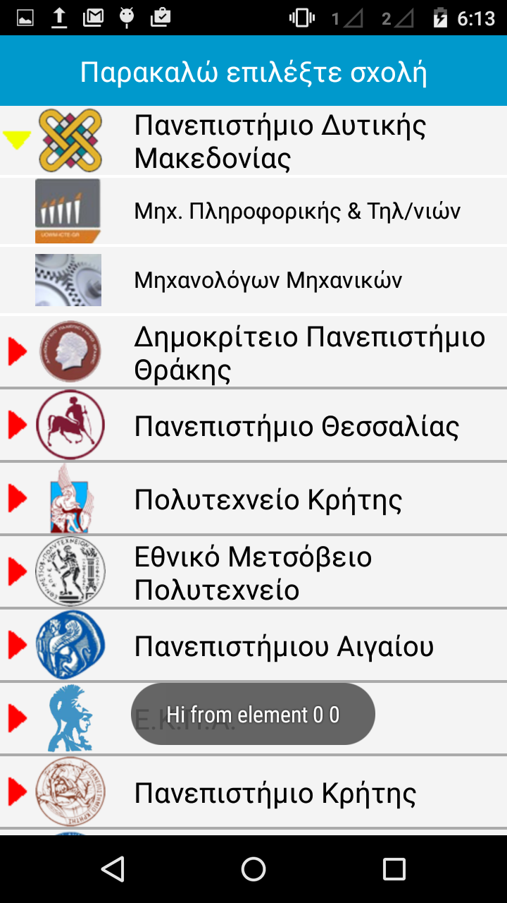

# ExpandableListViewSample
A custom android ExpandableListView sample

<i>This is a part of a side-project that I started about a year ago; mostly in greek, as it's referred to greek students.</i>

Features:
<ul>
	<li>Group and children listeners.</li>
	<li>Custom icons according to group/child.</li>
</ul>

  

